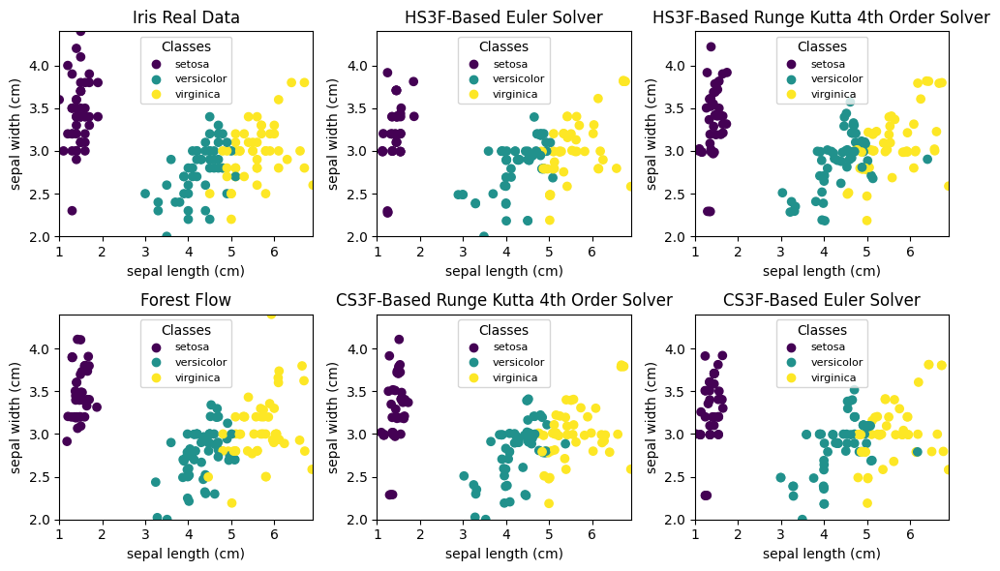
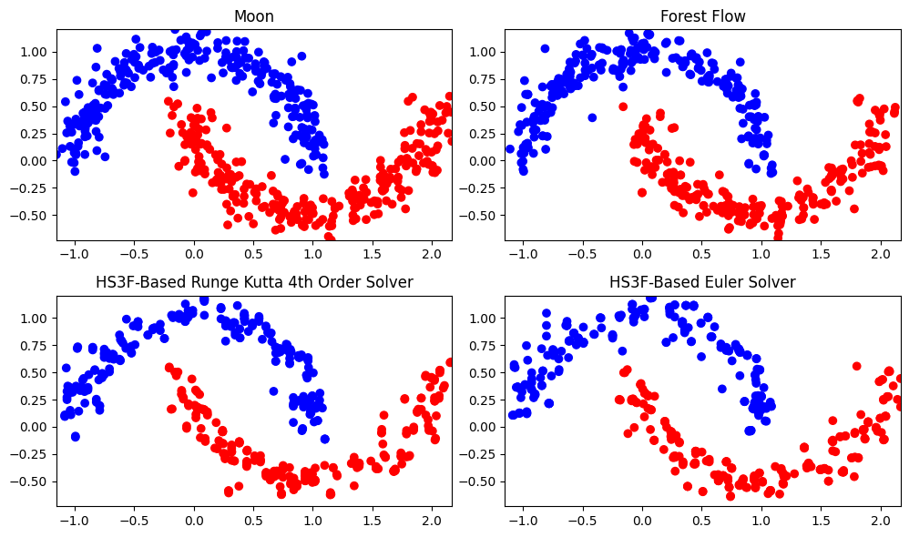

# Heterogeneous Sequential FeatureForestFlow (HS3F)
Link to the paper: [Generating Tabular Using Heterogeneous Sequential FeatureForestFlow](https://arxiv.org/abs/2410.15516)
## Description
ForestFlow matching is a powerful method for tabular data generation.  This method uses an XGBOOST model for predicting a velocity vector from the initial data that will be used to seek a flow (map that is smooth and differentiable that is generated by a velocity vector field) that will connect a noisy vector to the target distribution. This project introduces Heterogeneous Sequential FeatureForestFlow (HS3F) and its variants (CS3F), Heterogeneous sequential feature forest Flow (HS3F) extends ForestFlow  through an explicit mechanism to handle heterogeneity. HS3F processes data sequentially (feature after feature). This allows us to generate continuous features using FF, but handle categorical features using a (Xgboost) classifier. Categorical features are generated by randomly sampling from the probabilities of the learned classifier, which massively improves speed and closeness to the real data distribution.

 
<!-- -->

<!-- For better understanding of this code, I have designed a simpler version on [Google Colab](https://drive.google.com/file/d/13JOngqBCCOZc0ixlmDmLcIRPPljHyfvv/view?usp=sharing) -->

## How to use this repository
 ### List of important hyperparameters      
 <pre> 
* label_cond=False, #Boolean argument that specifies wether or not we use label-based conditional generation 
* duplicate_K= 100 #is the number of time we duplicate our data.
* mask_cat: #is the mask for categorical data (list containing True for categorical and False for Continuous).
* N=50 #is the number of noise level we are dealing with.
* cat_indexes=[], #Vector indicating which column is categorical/binary (the classes must be under the form [0,1,...,J]) if not, use label encoding before using your data.
* int_indexes=[], #vector which indicates which column is an integer (ordinal variables such as number of cats in a box).
 solver_type= "RG4" #takes two values: {"Euler": for Euler solver or "Rg4": for Runge Kutta solver}.
* model_type= 'HS3F'; #specifies whether we use the mixed model (`"HS3F"`:regressor and classifier or `"CS3F"`: regressor only).
* n_batch= 0 #is the number of mini batch | If >0 use the data iterator with the specified number of batches.
* n_jobs= -1, #specifies the number jobs you wish to exucute with your computing cores (-1 uses everything possible).
* one_hot_encoding= False: #Determine whether or not we will use one hot encoding (takes argument True or False)| but changing this is not necessary.
* t_0=1e-3, # Time intialization.
* seed= 0 #random seed value.
* max_depth= 7 #max depth of the tree; recommended to leave at default.
* n_estimators= 100 #number of trees per XGBoost model; recommended to leave at default.
* arg1 and arg2 are respectively, the remaining hyperparameter for tunning the regressor and the classifier ( We did not consider all the argument for our Xgboost regressor and classifier, ythe user will define them personnally if needed).
 </pre> 

### Work With Repository
1. Cloning
To clone this repository to your local machine, use the following command:
    * git clone https://github.com/AngeClementAkazan/Sequential-FeatureForestFlow.git
    * navigate into the code folder using "cd Sequential-FeatureForestFlow"
2. Create a virtual environment (You should create an virtual environment to avoid any dependency issues [More information about virtual environments](https://docs.python.org/3/library/venv.html))
    * python -m venv name_of_your_environment # Create your virtual environment
    * source myenv/bin/activate  # Use this to activate your virtual environment if you work on macOS/Linux
    * myenv\Scripts\activate     # Use this to activate your virtual environment if you work  Windows
    * pip install -r requirements.txt # Install all the needed libraries
3. Running all the model for all the data after cloning
    * To run this script, in your terminal run this:  `python -m unittest Test_Model.Test_class.test` (make sure you change the argument `parent` in the Test_Model.py before running)
4. Reproduce the iris and 2 Moons plots 
    * Use the notebook `Iris_Plot.ipynb`
5.  Navigating into the Seq3F folder where you can access useful functions
    * cd Seq3F 
### Important Notes
* Your dataset needs to be in numpy format. If you're using a pandas dataset, you can convert it to numpy format by using the command `dataset_numpy = dataset.to_numpy()`. Additionally, it's acceptable for the dataset to include missing values, the code contain a data processing part.
* The method uses a version of XGboost whose classifier models, demand that the class of each of the categorical variables of your  must have classes from {0,..., N}. Make sure you label encode your data.

<!-- You can either set the  variable `Use_OneHotEnc` to `True` or before you input your model you can use an appropriate encoding method to respect this constraint. -->

## Folder Structure
<pre>
├── Plots_material/
│   ├── CS3F_Euler_Results.csv     #CSV files for the CS3F-based Euler results 
│   ├── CS3F_Rg4_Results.csv       #CSV files for the CS3F-based Rg4 results
│   ├── FFM.csv                    #CSV files for the ForestFlow results
│   ├── HS3F_Euler_Results.csv     #CSV files for the HS3F-based Euler results
│   ├── HS3F_Rg4_Results.csv       #CSV files for the HS3F-based Rg4 results
│   ├── Plotting_Values.ipynb      #Contains code for plotting  the results for all metrics for each of the methods used in this study
├── Seq3F/
│   ├── __init__.py                #Initialization file  
│   ├── data_loader.py             #Contains functions for loading data
│   ├── Metrics.py                 #Contains functions for calculating metrics
│   ├── Flow_matching_class.py     #Contains classes and functions for flow matching
│   ├── S3F.py                     #Contains the main Sequential-FeatureForestFlow class 
│   ├── utlis.py                   #Contains functions that feeds Metrics.pyand S3F.py 
│       
├── .gitignore                      #List of files ignored by git (pycache and DS_Store)
├── ForestFlow.py                   #Contains the original ForestFlow Class
├── License.txt                     # The license terms
├── Iris_Plot.ipynb                 #Contain code to reprodu ce the iris file
├── README.md                       #This file
├──Requirements.txt                 #Contain requires lybraries
├── setup.py                        #File for installing project as a package
└── Test_Model.py                   #Test script for the package.

</pre>
<!-- <pre>
│
├── My_pachage/
│   ├── utils/
│       ├── __init__.py                 #Initialization file  for the utils modules
│       ├── Data_loading.py             #Contains functions for loading data
│       ├── Flow_matching_class.py      #Contains classes and functions for flow matching
│       ├── Metrics_Functions.py        #Contains functions for calculating metrics
│       ├── Solver_Functions.py         #Contains functions for solving problems 
│       ├── Training_Functions.py       #Contains functions for training models   
│    ├── __init__.py                    #Initialization file for the Sampling  module
│    ├── Sampling_Functions.py          #Contains functions for sampling data 
├── .gitignore                  #List of files ignored by git
├── License.txt                 # The license terms
├── README.md                   #This file
├── setup.py                    #File for installing project as a package
└── Test_Model.py               #Test script for the package.

</pre> -->
## Some references
List of implemented papers:

* Generating and Imputing Tabular Data via Diffusion and Flow-based
Gradient-Boosted Trees by Alexia Joliecoeur et. al [Github](https://github.com/SamsungSAILMontreal/ForestDiffusion)
* Improving and Generalizing Flow-Based Generative Models
with Minibatch Optimal Transport by Alexander Tong et. al [Github](https://github.com/atong01/conditional-flow-matching)
 ## Contributing

We welcome contributions from the community to help improve this project. If you encounter any issues or have suggestions for new features, please feel free to open an issue on GitHub.

### Reporting Issues and Feature Requests
* If you find a bug or have a problem with the project, please open an issue on the GitHub repository. Include detailed steps to reproduce the issue, including any error messages or screenshots.
* If you have an idea for a new feature or improvement, we'd love to hear about it! Please open an issue on the GitHub repository and describe your suggestion.

### Pull Requests
We also welcome contributions in the form of pull requests. If you'd like to contribute code changes, fixes, or new features, please follow these steps:

1. Fork the repository and create a new branch from `main`.
2. Make your desired changes in the new branch.
3. Test your changes  to ensure they work as expected.
4. Commit your changes with clear  commit messages.
5. Push your changes to your forked repository.
6. Open a pull request on the GitHub repository, stating the purpose of your changes and any relevant details.

We will review your pull request ASAP and provide feedback or merge it (if it meets our standards).
## Citing the paper
 <pre>  
@misc{akazan2024generatingtabulardatausing,
      title={Generating Tabular Data Using Heterogeneous Sequential Feature Forest Flow Matching}, 
      author={Ange-Clément Akazan and Alexia Jolicoeur-Martineau and Ioannis Mitliagkas},
      year={2024},
      eprint={2410.15516},
      archivePrefix={arXiv},
      primaryClass={cs.LG},
      url={https://arxiv.org/abs/2410.15516}, 
}
<pre>
<!-- ## License
 <pre> 
 MIT License

Copyright (c) 2024 Ange-Clément Akazan All Rights Reserved.

Permission is hereby granted, free of charge, to any person obtaining a copy
of this software and associated documentation files (the "Software"), to deal
in the Software without restriction, including without limitation the rights
to use, copy, modify, merge, publish, distribute, sublicense, and/or sell
copies of the Software, and to permit persons to whom the Software is
furnished to do so, subject to the following conditions:

The above copyright notice and this permission notice shall be included in all
copies or substantial portions of the Software.

THE SOFTWARE IS PROVIDED "AS IS", WITHOUT WARRANTY OF ANY KIND, EXPRESS OR
IMPLIED, INCLUDING BUT NOT LIMITED TO THE WARRANTIES OF MERCHANTABILITY,
FITNESS FOR A PARTICULAR PURPOSE AND NONINFRINGEMENT. IN NO EVENT SHALL THE
AUTHORS OR COPYRIGHT HOLDERS BE LIABLE FOR ANY CLAIM, DAMAGES OR OTHER
LIABILITY, WHETHER IN AN ACTION OF CONTRACT, TORT OR OTHERWISE, ARISING FROM,
OUT OF OR IN CONNECTION WITH THE SOFTWARE OR THE USE OR OTHER DEALINGS IN THE
SOFTWARE. 
<pre> -->

<!-- #endregion -->
