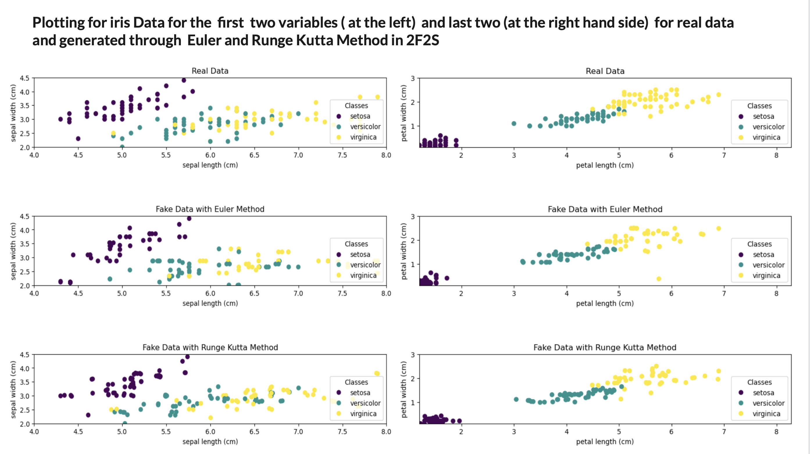

# Forest-FLow-Based-Variable-Sampling

## Description
Forest Flow matching is powerful method for tabular data generation.  This method uses a XGBOOST model for predicting a velocity vector from the initial data, that will be used to seek for a flow (map that is smooth and differentiable that is generated by a velocity vector field) that will connect a noisy vector to the target distribution. This project introduces Forest-FLow-Based-Variable-Sampling (2F2S),  a modified version of Forest flow, that  fosters a better data generation quality. 2F2S uses a XGBOOST model to predict a velocity vector for each variable of the initial data in an progressive way (generate variable 1 and use the result to predict  variable 2 and so fourth). This method guarantees better data generation and prospects a novel style objective for diffudion models.

For better understanding of this code, I have designed a simpler version on [Google Colab](https://drive.google.com/file/d/13JOngqBCCOZc0ixlmDmLcIRPPljHyfvv/view?usp=sharing)

## How to use this repository
 ### List of important hyperparameters

* dt_loader: is the data to be inputted 
* K_dpl: is the number of time we duplicate our data 
* mask_cat: is the mask for categorical data (list containing True for categorical and False for Continuous)
* N: is the number of noise level we are dealing with 
which_solver: takes two values: {Euler: for Euler solver or RG4: for Runge Kutta solver}
* model_type: specifies whether we have a mixed model (regressor and classification) or regressor only.
* cat_sampler_type: determine whether we use the Xgboost model prediction directly for sampling(in that case the argument take the value "model_prediction-based") or we use the output probability of our Xgboost and then use a multinoimial sampler(and the argument take "proba-based")
* Use_OneHotEnc: Determine whether or not we will use one hot encoding (takes argument True or False).
* arg1 and arg2 are respectively, the remaining hyperparameter for tunning the regressor and the classifier ( We did not consider all the argument for our Xgboost regressor and classifier, ythe user will define them personnally if needed)
      
### Cloning the Repository

To clone this repository to your local machine, use the following command:

*  git clone https://github.com/AngeClementAkazan/Forest-FLow-Based-Variable-Sampling.git 
* cd Forest-FLow-Based-Variable-Sampling 

### Very mportant point
* Your dataset needs to be in numpy format. If you're using a pandas dataset, you can convert it to numpy format by using the command `dataset_numpy = dataset.to_numpy()`. Additionally, it's acceptable for the dataset to include missing values, the code contain a data processing part.
* The method uses a XGboost model, which demand that the class of each of the categorical variables of your  must have classes from {0,..., N}. 
You can either set the  variable `Use_OneHotEnc` to `True` or before you input your model you can use an appropriate encoding method to respect this constraint.
## Some references
List of implemented papers:

* Generating and Imputing Tabular Data via Diffusion and Flow-based
Gradient-Boosted Trees by Alexia Joliecoeur et. al [Github](https://github.com/atong01/conditional-flow-matching)
* Improving and Generalizing Flow-Based Generative Models
with Minibatch Optimal Transport by Alexander Tong et. al [Github](https://github.com/atong01/conditional-flow-matching)
## Folder Structure
<pre>
│
├── My_pachage/
│   ├── utils/
│       ├── __init__.py                 #Initialization file  for the utils modules
│       ├── Data_loading.py             #Contains functions for loading data
│       ├── Flow_matching_class.py      #Contains classes and functions for flow matching
│       ├── Metrics_Functions.py        #Contains functions for calculating metrics
│       ├── Solver_Functions.py         #Contains functions for solving problems 
│       ├── Training_Functions.py       #Contains functions for training models   
│    ├── __init__.py                    #Initialization file for the Sampling  module
│    ├── Sampling_Functions.py          #Contains functions for sampling data 
├── .gitignore                  #List of files ignored by git
├── License.txt                 # The license terms
├── README.md                   #This file
├── setup.py                    #File for installing project as a package
└── Test_Model.py               #Test script for the package.

</pre>

 ## Contributing

We welcome contributions from the community to help improve this project. If you encounter any issues or have suggestions for new features, please feel free to open an issue on GitHub.

### Reporting Issues
If you find a bug or have a problem with the project, please open an issue on the GitHub repository. Be sure to include detailed steps to reproduce the issue, including any error messages or screenshots if applicable.

### Feature Requests
If you have an idea for a new feature or improvement, we'd love to hear about it! Please open an issue on the GitHub repository and describe your suggestion in detail.

### Pull Requests
We also welcome contributions in the form of pull requests. If you'd like to contribute code changes, fixes, or new features, please follow these steps:

1. Fork the repository and create a new branch from `main`.
2. Make your desired changes in the new branch.
3. Test your changes thoroughly to ensure they work as expected.
4. Commit your changes with clear and descriptive commit messages.
5. Push your changes to your forked repository.
6. Open a pull request on the GitHub repository, explaining the purpose of your changes and any relevant details.

We'll review your pull request as soon as possible and provide feedback or merge it if it meets our guidelines.

## License
 <pre> MIT License

Copyright (c) 2024 Ange-Clément Akazan All Rights Reserved.

Permission is hereby granted, free of charge, to any person obtaining a copy
of this software and associated documentation files (the "Software"), to deal
in the Software without restriction, including without limitation the rights
to use, copy, modify, merge, publish, distribute, sublicense, and/or sell
copies of the Software, and to permit persons to whom the Software is
furnished to do so, subject to the following conditions:

The above copyright notice and this permission notice shall be included in all
copies or substantial portions of the Software.

THE SOFTWARE IS PROVIDED "AS IS", WITHOUT WARRANTY OF ANY KIND, EXPRESS OR
IMPLIED, INCLUDING BUT NOT LIMITED TO THE WARRANTIES OF MERCHANTABILITY,
FITNESS FOR A PARTICULAR PURPOSE AND NONINFRINGEMENT. IN NO EVENT SHALL THE
AUTHORS OR COPYRIGHT HOLDERS BE LIABLE FOR ANY CLAIM, DAMAGES OR OTHER
LIABILITY, WHETHER IN AN ACTION OF CONTRACT, TORT OR OTHERWISE, ARISING FROM,
OUT OF OR IN CONNECTION WITH THE SOFTWARE OR THE USE OR OTHER DEALINGS IN THE
SOFTWARE. <\pre>

